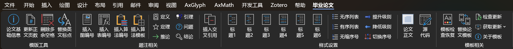

# 成都信息工程大学硕士学位论文模版

## 简介

本项目通过规范论文中的样式，并简化一些复杂操作，希望帮助学生提高毕业论文撰写效率。目前，仅支持在 Word 上的使用，已经 Word 2021 上测试可以正常执行。

## 使用说明

### 获取模板

- 从版本库上下载
  目前，可以从 Github 和 Gitee 上免费获得该模版。在工程的 Release 目录下，有该模板的最新版本。

      https://github.com/sk8boy/cuit_dissertation_template
      https://gitee.com/tiejunwang/cuit_dissertation_template

- 从模板菜单中获取
  若你已经拥有模板，可以直接在 Word 的菜单 “毕业论文” 页面，找到 “获取更新” 下拉菜单，从中选择一个版本库连接进行下载。

### 样式说明

模版根据《（2025 年版）中文硕士学位论文模板》和《（2025 年版）中文硕士学位论文格式范例》两个文件，定义了如下样式。

其中，“论文”开始的样式为自定义样式，用户可在撰写论文时直接选用。此外，图中“AMDisplayEquation”和“AMEquationSection”两个样式，是安装并使用了 AxMath（公式编辑器，可替代 MathType，价格上有优势）之后添加的样式。

### 推荐工具

为了便于论文撰写，建议安装公式编辑器和参考文献工具。

- 公式编辑器，推荐安装国产工具 AxMath，功能上和 MathType 相仿，价格上有明显优势。
  https://www.amyxun.com/

- 参考文献工具，推荐使用 Zotero，完全免费。对于参考文献引用、更新、格式设置均较友好。参考文献引用的样式，可直接使用“GB/T 7714-2015（顺序编码，双语）”，符合毕业论文的样式要求。
  https://www.zotero.org/

### 菜单使用

为了方便，将常用的功能集成到了 Word 的菜单上，分为 模板工具、题注相关、样式设置和模板相关四个功能区。

1. 填写基础信息

为了规范论文封面（下图），一些基础信息设置成了控件，规范了样式，并且有些设置为不可直接编辑。

为此，建议在首次打开模版时，通过菜单中 “论文基础信息” 按钮，打开基础信息填写窗口。

填写上必要信息后，单击 “确定” 按钮可实现内容自动更新。

对于封面上不需要的信息，如“其他导师”的导师姓名、职称控件可进行删除。

基础信息填写后，下次打开将会提取之前填写的信息，方便后续进行作者进行更新，包括论文的中英文题目。

这些基础性将会多次出现论文的不同地方。例如，在原创性声明页面，会替换模板中的 “论文中文题目” 和 “导师姓名”。

中英文摘要页面，论文的中英文题目将会替换 “学位论文中文题目” 和 “Disserattion in English” 内容。

2. 更新正文页数

在论文中，正文页数定义为从 “第一章” 开始到 “致谢” 结束的页数。论文中有两个地方涉及到正文页数。一个是目录页上的 “论文总页数” 标记。

另一个是论文正文中页脚的 “共 XX 页”。

当点击 “更新正文页数” 按钮后，会弹出如下窗口，提示输入第一章的标题。默认情况下，是 “绪论”。当作者更改了论文第一章标题后，需要在输入框中输入正确的第一章标题。单击 “确定” 按钮后将统计正文页数，提示结果，并对上述两个引用了正文页数的标签进行更新。

3. 删除多余空格

当从网页或其他程序中拷贝内容到论文后，有时会在中英文直接、或者两个中文字符间插入额外的空格。此时，可选中需要清楚空格的段落文字，单击该按钮，可清楚多余空格。

注意：本功能不会删除英文字符间的空格，因此不用担心将英文内容的样式弄乱。

4. 插入图片和图编号

图题需要出现的图片下发。首先，需要插入图片，并在样式列表中选择 “论文图” 样式。

换行后，在图片下方为图键入标题。然后，将光标定位到图题开始处，单击 “插入图编号” 按钮。模板将会根据所在章节，自动生成 “图章节编号-图号 ” 样式的图编号。

5. 插入表和表编号

表题需要出现在表格上方。所以，首先将光标定位在新行中，并单击按钮 “插入表编号”，让后在编号后方键入表题。此外，页可以先键入表题，然后将光标移动到表题开始处，单击按钮 “插入表编号” 完成表题编写。

插入表题后，另起一行，可根据需要插入表格。选中插入的表格，在 “表格样式” 中选择模板自带的 “三线表” 样式。并根据需要，在左边的 “表格样式选项” 中选择，表格是否包含标题行、第一列等信息。

在表格中插入文字后，可选中整个表格，在样式列表中应用 “论文表格文字”，统一字体和段落样式。然后，在根据需要，调整对其。

6. 插入算法

模版提供的算法包括算法名称、输入、输出、伪代码四个部分。若需要在论文中插入算法，可单击 “插入算法” 按钮。此时，模版将自动插入一个带编号的算法模板，如下图所示。

之后，可在算法编号后面键入标题，并在表格中键入相应内容。作者也可以根据需要，自行对算法表格进行调整。

7. 插入数学证明相关的题注

为了描述一下数学问题，论文中可能会用到 定义、定理、引理、推论、问题等题注。通过单击相应的按钮，可完成相关内容插入，如下图所示。

8. 插入交叉引用

上传 4-7 小节插入的，在 Word 中均被定义为 “题注”。若需要在正文中对上述插入的题注进行引用，可使用 “插入交叉引用” 功能。

使用该功能，需要单击两次 “插入交叉引用” 按钮。

- 首先，需要将光标定位到正文中需要插入 “交叉引用” 的位置，然后单击该按钮。

- 然后，将光标定位到需要引用的题注上，例如 “图 3-1”、“定义 2-3”、“算法 4-1”等位置，最后在第二次单击该按钮，完成交叉引用的插入。

插入交叉引用后，当题注的编号有更新时，只需要按 “F9” 功能键，就可完成相关引用的更新。

9. 样式设置

- 标题样式

## 开发说明
