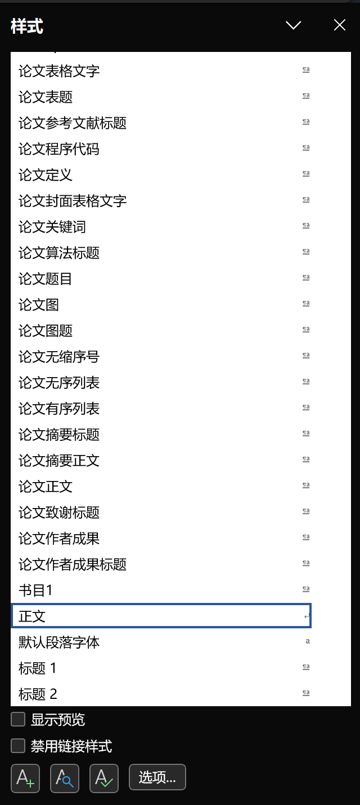

# 成都信息工程大学硕士学位论文模版

## 简介

本项目通过规范论文中的样式，并简化一些复杂操作，希望帮助学生提高毕业论文撰写效率。目前，仅支持在 Word 上的使用，已经 Word 2021 上测试可以正常执行。

## 使用说明

### 获取模板

- 从版本库上下载
  目前，可以从 Github 和 Gitee 上免费获得该模版。在工程的 Release 目录下，有该模板的最新版本。
  https://github.com/sk8boy/cuit_dissertation_template
  https://gitee.com/tiejunwang/cuit_dissertation_template

- 从模板菜单中获取
  若你已经拥有模板，可以直接在 Word 的菜单 “毕业论文” 页面，找到 “获取更新” 下拉菜单，从中选择一个版本库连接进行下载。

### 样式说明

模版根据《（2025 年版）中文硕士学位论文模板》和《（2025 年版）中文硕士学位论文格式范例》两个文件，定义了如下样式。

其中，“论文”开始的样式为自定义样式，用户可在撰写论文时直接选用。此外，图中“AMDisplayEquation”和“AMEquationSection”两个样式，是安装并使用了 AxMath（公式编辑器，可替代 MathType，价格上有优势）之后添加的样式。

### 推荐工具

为了便于论文撰写，建议安装公式编辑器和参考文献工具。

- 公式编辑器，推荐安装国产工具 [AxMath](https://www.amyxun.com/)，功能上和 MathType 相仿，价格上有明显优势。

- 参考文献工具，推荐使用 [Zotero](https://www.zotero.org/)，完全免费。对于参考文献引用、更新、格式设置均较友好。参考文献引用的样式，可直接使用“GB/T 7714-2015（顺序编码，双语）”，符合毕业论文的样式要求。

### 使用模板

作者可以通过以下两种方式使用模版。

1. 全新撰写

若在作者开始撰写毕业论文前拿到了该模版，在确保使用了最新版本后，可以通过双击模版文件（成都信息工程大学硕士学位论文模版 vX.X.X.dotm），使用 Word 程序创建一个新的论文文件。

此时，可以参考下面的 “菜单使用” 说明，全新撰写一篇学位论文。

2. 半路插入

如果你已经开始着手写论文，或者毕业论文已经将近完成，此时可通过下面方法应用该模版。

    - 使用 Word 打开毕业论文文件。

    - 通过 Word 的 “文件 - 选项” 功能，打开如下所示的 “Word 选项” 窗口。在该窗口中，选择 “加载项” 页面， 在 “管理” 的下拉列表中选择 “模版” 选项，单击 “转到” 按钮。

    - 接下来，在打开的 “模版和加载项” 窗口中，默认情况下下，作者对论文应该使用的是 “Normal” 模版。此时，单击 “选用” 按钮，在弹出窗口中选中活动的该模板。单击 “确定” 按钮，关闭 “模版与加载项” 窗口。此时，该模版将应用到了作者的论文中。

    - 最后，打开 “毕业论文” 选项卡，单击 “模版检查恢复” 按钮，在作者的论文中创建必要的样式。

    注意，这种情况下，因为论文中没有插入模版中控件，因此 “论文基础信息” 和 “更新正文页数” 功能将无法正常使用。若要使用该功能，需要从模板中将 首页、原创新声明页、中英文摘要页、目录页 插入到现在的论文中后，才能正常使用。

### 菜单使用

为了方便，将常用的功能集成到了 Word 的菜单上，分为 模板工具、题注相关、样式设置和模板相关四个功能区。

1. 填写基础信息

为了规范论文封面（下图），一些基础信息设置成了控件，规范了样式，并且有些设置为不可直接编辑。

为此，建议在首次打开模版时，通过菜单中 “论文基础信息” 按钮，打开基础信息填写窗口。

填写上必要信息后，单击 “确定” 按钮可实现内容自动更新。

对于封面上不需要的信息，如“其他导师”的导师姓名、职称控件可进行删除。

基础信息填写后，下次打开将会提取之前填写的信息，方便后续进行作者进行更新，包括论文的中英文题目。

这些基础性将会多次出现论文的不同地方。例如，在原创性声明页面，会替换模板中的 “论文中文题目” 和 “导师姓名”。

中英文摘要页面，论文的中英文题目将会替换 “学位论文中文题目” 和 “Disserattion in English” 内容。

2. 更新正文页数

在论文中，正文页数定义为从 “第一章” 开始到 “致谢” 结束的页数。论文中有两个地方涉及到正文页数。一个是目录页上的 “论文总页数” 标记。

另一个是论文正文中页脚的 “共 XX 页”。

当点击 “更新正文页数” 按钮后，会弹出如下窗口，提示输入第一章的标题。默认情况下，是 “绪论”。当作者更改了论文第一章标题后，需要在输入框中输入正确的第一章标题。单击 “确定” 按钮后将统计正文页数，提示结果，并对上述两个引用了正文页数的标签进行更新。

3. 删除多余空格

当从网页或其他程序中拷贝内容到论文后，有时会在中英文直接、或者两个中文字符间插入额外的空格。此时，可选中需要清楚空格的段落文字，单击该按钮，可清楚多余空格。

注意：本功能不会删除英文字符间的空格，因此不用担心将英文内容的样式弄乱。

4. 插入图片和图编号

图题需要出现的图片下发。首先，需要插入图片，并在样式列表中选择 “论文图” 样式。

换行后，在图片下方为图键入标题。然后，将光标定位到图题开始处，单击 “插入图编号” 按钮。模板将会根据所在章节，自动生成 “图章节编号-图号 ” 样式的图编号。

5. 插入表和表编号

表题需要出现在表格上方。所以，首先将光标定位在新行中，并单击按钮 “插入表编号”，让后在编号后方键入表题。此外，页可以先键入表题，然后将光标移动到表题开始处，单击按钮 “插入表编号” 完成表题编写。

插入表题后，另起一行，可根据需要插入表格。选中插入的表格，在 “表格样式” 中选择模板自带的 “三线表” 样式。并根据需要，在左边的 “表格样式选项” 中选择，表格是否包含标题行、第一列等信息。

在表格中插入文字后，可选中整个表格，在样式列表中应用 “论文表格文字”，统一字体和段落样式。然后，在根据需要，调整对其。

6. 插入算法

模版提供的算法包括算法名称、输入、输出、伪代码四个部分。若需要在论文中插入算法，可单击 “插入算法” 按钮。此时，模版将自动插入一个带编号的算法模板，如下图所示。

之后，可在算法编号后面键入标题，并在表格中键入相应内容。作者也可以根据需要，自行对算法表格进行调整。

7. 插入数学证明相关的题注

为了描述一下数学问题，论文中可能会用到 定义、定理、引理、推论、问题等题注。通过单击相应的按钮，可完成相关内容插入，如下图所示。

8. 插入交叉引用

上面 4 - 7 小节插入的编号项目，在 Word 中均被定义为 “题注”。若需要在正文中对上述插入的题注进行引用，可使用 “插入交叉引用” 功能。

使用该功能，需要单击两次 “插入交叉引用” 按钮。

- 首先，需要将光标定位到正文中需要插入 “交叉引用” 的位置，然后单击该按钮。

- 然后，将光标定位到需要引用的题注上，例如 “图 3-1”、“定义 2-3”、“算法 4-1”等位置，最后在第二次单击该按钮，完成交叉引用的插入。

插入交叉引用后，当题注的编号有更新时，只需要按 “F9” 功能键，就可完成相关引用的更新。

9. 样式设置

- 标题样式

定义了 1 ~ 6 级标题，若要应用标题样式，将光标定位到标题文字上方，单击该按钮后，可自动设定样式。其中，标题序号格式为 “第一章”、“1.1”、“1.1.1”。标题序号自动编号，不行键入。

论文的目录会根据标题自动生成，生成时默认只有前三级标题会显示在目录中。

- 列表样式

为了方便使用，模板定义了 “无序列表”、“有序列表”和“无缩序号” 三种形式的列表，如下图所示。

    - 无序列表： 以 实心原点 为开头，后面文字自动缩进对齐。

    - 有序列表： 以 "1." "2." 形式开头，自动编号，后面文字自动缩进对齐。

    - 无缩序号： 以 “(1)” “(2)” 形式开头，自动编号，后面文字保留 “论文正文” 样式，会被缩进。

以上三种列表形式，作者可根据实际需要进行选则。通过选中相应的文字段落，单击对应的按钮，可完成列表样式设置。

上述三个列表，实际上都是 “多级列表”，可以通过单击 “提升级别” 和 “降低级别” 按钮，对列表的级别进行修改。对于 “无序列表”，提升和较低级别，将影响开头的符号和缩进量；对于其他列表，将会影响开头的编号和缩进量。

对于 “有序列表” 和 “无缩序号”，将光标定位到需要修改编号顺序的段落,然后单击 “切换序号” 按钮，实现在 “连续编号” 和 “重新开始编号” 直接进行切换。

- 论文正文

选中需要应用 “论文正文” 样式的文字，单击 “论文正文” 按钮，可将选中文字的样式修改为论文正文。也可以在选中文字后，在样式列表中选中 “论文正文” 样式进行使用。

- 源代码

选中需要应用 “论文程序代码” 样式的文字，单击 “论文正文” 按钮，可将选中文字的样式修改为论文正文。也可以在选中文字后，在样式列表中选中 “论文程序代码” 样式进行使用。

10. 模版项目

当作者对模板中自定义代码进行了修改，或者因为带格式粘贴其他文字内容后，使得模板中自定义样式发生了变化，可通过单击 “模版检查恢复” 按钮，对自定义样式进行恢复。

同时，该功能还将恢复文件的 “页面设置” 参数，包括页面大小、页边距、装订线等设置。

## 开发说明
